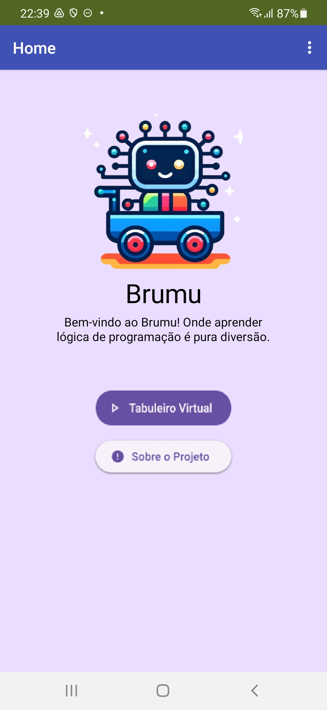
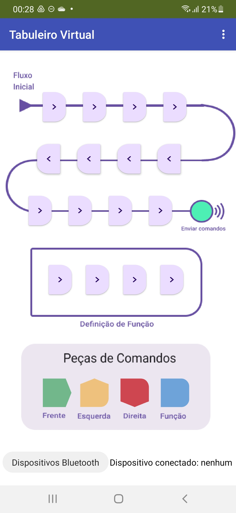
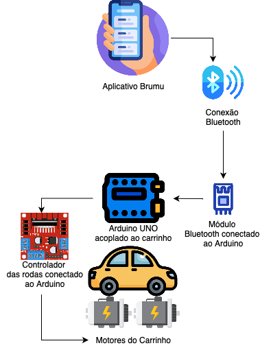
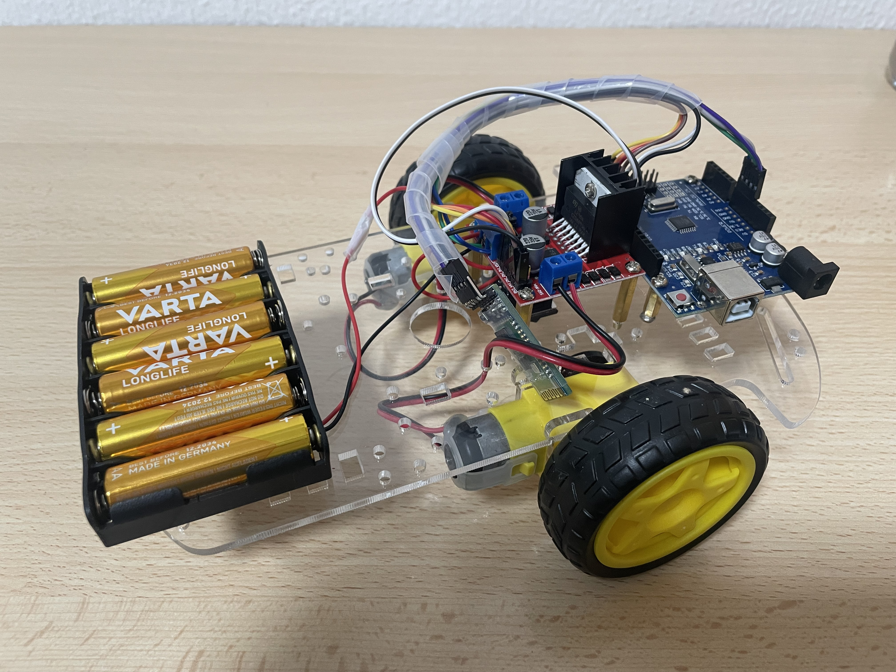

# Brumu: Kit Educacional de Baixo Custo para o Desenvolvimento do Pensamento Computacional

Este repositório apresenta o **Brumu**, um kit educacional de robótica idealizado para **promover o Pensamento Computacional (PC)** em crianças de **3 a 9 anos** de maneira **acessível** e **lúdica**. O projeto se inspira no brinquedo **Cubetto**, porém com **custo significativamente menor**, combinando um **aplicativo mobile** (desenvolvido no [MIT App Inventor](https://appinventor.mit.edu/)) e um **robô** construído com **componentes amplamente disponíveis** no mercado.

---

## Motivação

- **Pensamento Computacional**: Conceito proposto por Jeannette Wing que ressalta a importância de desenvolver habilidades como lógica, abstração e resolução de problemas desde cedo.  
- **Alinhamento à BNCC**: No Brasil, a **Base Nacional Comum Curricular** destaca o papel do PC no processo de ensino, recomendando sua aplicação ainda na Educação Básica.  
- **Robótica Educacional**: Estratégia lúdica para ensinar conceitos de **programação**, **lógica** e **trabalho em equipe**, estimulando a criatividade e o aprendizado ativo.

---

## Principais Componentes

1. **Aplicativo Mobile (Brumu App)**
   - Desenvolvido no **MIT App Inventor**.  
   - Apresenta um **tabuleiro virtual**, onde a criança pode arrastar blocos de comando (Frente, Esquerda, Direita, Função).  
   - Conecta-se ao robô via **Bluetooth** para enviar sequências de movimentos.

2. **Robô (Carrinho/Brumu)**
   - Baseado no **Arduino UNO**, acoplado a motores DC e módulo **HC-05** para comunicação Bluetooth.  
   - Controlado por uma **Ponte H L298N**, que gerencia velocidade e direção dos motores.  
   - Movimenta-se em torno de 15 cm para frente a cada comando e gira 90° para a esquerda ou direita em seu próprio eixo.

3. **Manual de Montagem e Uso**
   - Contém instruções detalhadas para construção e configuração do Brumu.  
   - Disponível junto ao repositório para facilitar a **replicação** do kit.

---

## Screenshots

### Tela Inicial do Aplicativo

### Tabuleiro Virtual

### Fluxo de Comportamento entre App e Robô

### Carrinho Construído

---

## Como Funciona

1. **Instalação do App**
   - Baixe o arquivo `.apk` em um dispositivo **Android** e instale.
2. **Conexão Bluetooth**
   - Ligue o robô (coloque pilhas, ative o botão liga/desliga).
   - Pareie com o módulo **HC-05** (senha padrão costuma ser `1234` ou `0000`).
3. **Montagem de Sequências**
   - No **Tabuleiro Virtual**, arraste blocos (Frente, Esquerda, Direita, Função) para criar a sequência desejada.
   - Se o percurso for longo, utilize **Função** para otimizar blocos repetidos.
4. **Envio de Comandos**
   - Toque em **Enviar** para que o robô execute o trajeto programado.
   - Observe o movimento do Brumu em um **mapa físico** ou outro cenário lúdico que você criar.

---

## Passo a Passo para Construir o Robô

1. **Componentes Necessários**
   - 1 × Arduino UNO  
   - 1 × Módulo Bluetooth HC-05  
   - 1 × Ponte H L298N  
   - 1 × Chassi 2WD (com 2 motores DC)  
   - 6 × Pilhas AA (e suporte)  
   - Parafusos, cabos, fita, etc.

2. **Montagem**
   - Fixe motores e roda boba no chassi.
   - Conecte o Arduino UNO à Ponte H e ao HC-05, seguindo o esquema do manual.
   - Adicione o suporte de pilhas e instale o botão liga/desliga.

3. **Programação**
   - Use a **IDE do Arduino** para carregar o firmware no Arduino UNO.
   - O código configura o recebimento de comandos via Bluetooth e calcula rotações de motor para avançar e girar.

---

## Resultados e Contribuições

- **Custos Reduzidos**: Em torno de **R\$181,23** para montar o robô, comparado aos R\$2.200,00 do Cubetto, gerando uma economia de aproximadamente **91,76%**.
- **Acessibilidade e Replicabilidade**: Ideal para **escolas** e **centros de ensino** que desejam incorporar robótica educacional sem grandes investimentos.
- **Escalabilidade**: Possibilidade de criar mapas temáticos e **planos de aula** que integrem diversas disciplinas (Matemática, Geografia, Ciências etc.).

---

## Próximos Passos

- **Publicar App**: Disponibilizar o aplicativo em lojas oficiais (Google Play).
- **Testes de Usabilidade**: Realizar estudos com crianças e professores para avaliar **aceitação** e melhorias.
- **Planos de Aula**: Desenvolver roteiros didáticos que associem o Brumu às matérias da **Educação Básica**.
- **Expansão de Recursos**: Acrescentar sensores, mapas específicos e outras ferramentas de apoio pedagógico.

---

## Referências Principais

- WING, J. M. *Computational Thinking*. Commun. ACM, 49(3), 2006.  
- [BNCC – Base Nacional Comum Curricular](https://www.gov.br/mec/pt-br/escola-em-tempo-integral/BNCC_EI_EF_110518_versaofinal.pdf)  
- [MIT App Inventor](https://appinventor.mit.edu/)  
- [Arduino UNO](https://www.arduino.cc/)

Para mais detalhes, consulte o [Artigo completo](./Artigo_CompletoBRUMU.pdf) e o [repositório oficial do Brumu](https://github.com/munir-souza/BRUMU.git).

---

### Autoria

- **Bruna Cristhine Amarilha Teles** (FACOM – UFMS)  
- **Munir Souza dos Santos** (FACOM – UFMS)  
- **Prof.ª Luciana Montera Cheung** (Orientadora – FACOM – UFMS)

### Licença

Este projeto está disponível sob a licença [MIT License](LICENSE).  

**Brumu** é um passo concreto para tornar a robótica educacional mais acessível, estimulando a criatividade e o **Pensamento Computacional** em crianças de diferentes faixas etárias. Sinta-se à vontade para contribuir, adaptar e compartilhar!
